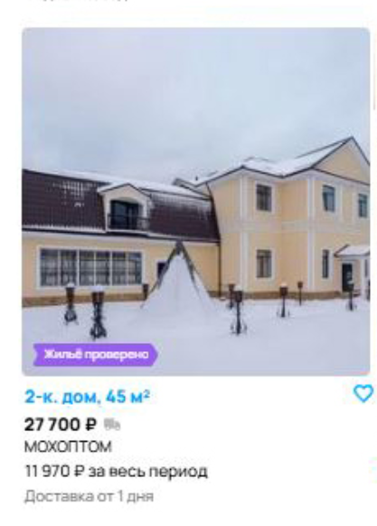

## Баги на странице со скриншота

**1. [Кнопка "Найти"]** Ошибка в наименовании  
**Приоритет**: medium (функционал не нарушен, но негативно влияет на опыт пользователя и находится на самом видном месте)  

**2. [Карта]** Несоответсвие искомой локации и отображаемой  
**Приоритет**: high  

**3. [Кол-во объявлений]** В заголовке указано, что найдено 6 объявлений. По факту отображено 9  
**Приоритет**: medium  

**4. [Хлебные крошки]** Ищем посуточную, а отображается "На длительный срок"  
**Приоритет**: low   

**5. [Отображение объявлеий]** Выбран способ отображения "На карте", но отображается плитками  
**Приоритет**: high  

**6. [Сортировка]** Сортировка по дате от самого нового к старому, но сортировка не работает (первое объявление за 2016 год
объявление; объявление, что размещено 4 часа назад не первое)  
**Приоритет**: high 

**7. [Сортировка. Иконка]** Индикатор закрытого выпадающего списка "съехал" вниз   
**Приоритет**: low  

**8. [Фильтр. Цена за сутки]** Фильтрация по цене не применилась  
**Приоритет**: high  

9 ?? 
**Приоритет**: ??  

**11. [Подвал сайта]** Отсутствуют ссылки на скачивание приложения, юридическая информация, ссылки на социальные сети и
ссылки на информацию как о компании, так и о сайте
**Приоритет**: high (отсутсвие "Политики конфиденциальности" - нарушение федерального закона)  

**12. [Несоответствие выдачи и запроса]**  Ищем аренду домов, а в выдаче доставка. Так же есть сумма за весь период
**Приоритет**: high  

**13. [Отображение итоговой суммы (пункт 1)]**  Дом снимают на 3 дня. 21 667 * 3 = 65 001.
Потерялся рубль, хотя округление есть и на сайте :). Люди могут быть недовольны, когда такая мелочь испортит им настроение  
**Приоритет**: medium  

**14. [Ошибка модерации (пункт 2)]**  Ожидаем, что будут изображения дома, а по итогу реклама окон    
**Приоритет**: high  

**15. [Ошибка модерации]**  На изображении игрушечный дом, но он в разделе с арендой жилья   
**Приоритет**: high  

**16. [Ошибка модерации]**  Часть объявлений находится в селах, где нет метро, хотя стоит фильтр 5 минут до метро. 
У других не указано это самое метро. Но они были выдано пользователю. 
Справедливости ради отмечу, что пользователи так делают и в реальных объявлениях (ставят точку у метро, а сам дом за 90 км от Москвы)
**Приоритет**: high  

**17. [Пагинация]**  Открыта последняя страница, хотя пагинация для 6, если верить заголовку, объявлений не нужна. 
Для 9, которые по факту, тоже. Ввиду того, что отображается раздел "Вас может заинтересовать", а не "N объявлений есть в других городах", тоже  
**Приоритет**: medium. 

**18. [Результаты поиска]** Не совпадает найденное количество объявлений в кнопке “Показать N объявлений” и в заголовке страницы
**Приоритет**: medium (кнопка всё равно должна быть доступна с текстом "Показать объявления")

**19. [Результаты поиска]** Выбран фильтр "Без залога", но отображается объявление с тегом "Мгновенная бронь"
**Приоритет**: Если есть пересечени тегов, то не баг. Иначе - medium. Нужно больше информации  

